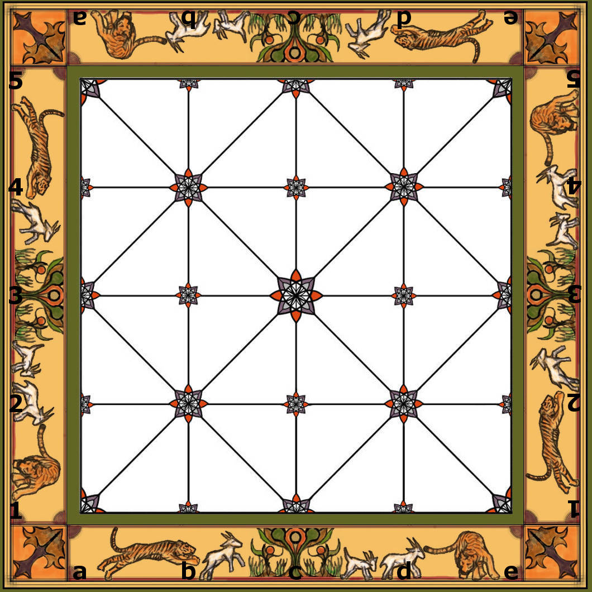
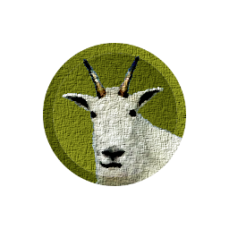
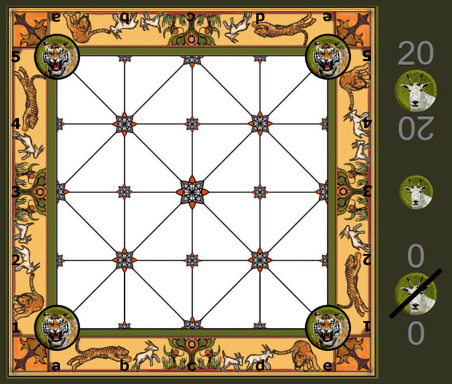

 BaghChal
=============

<b>Keywords, Categories</b> <em>Board Games, Games/Entertainment, Mobile, Abstract Game, Perfect-Information, 2-player Strategy Game</em>

This is an implementation of the two-player abstract perfect-information
strategy board game Bagh Chal for HTML5/Javascript/CSS platform.

<b>Bagh Chal</b> - traditional abstract Nepalese board game

# Bagh Chal Rules

<b>Bagh Chal</b> is a board game. 

## Game Components

<table>
  <tr>
    <td width='66%'>

    </td>
    <td width='17%'>

    </td>
    <td width='17%'>

    </td>
  </tr>
</table>

The rectangular Bagh Chal board has fixed dimension of 5 times 5 positions horizontally
and vertically. Positions on board are connected by a fixed line pattern showing potential
paths of movement for players’ checkers. The checkers are placed on the positions (or
points) of line intersections in the line pattern. There are two opposing players:
one is controlling the four checkers representing tigers and the other is controlling
the twenty checkers representing goats.

## Objective

Objective of the game differs for each of the two players.
The player controlling the tigers wins by either capturing a predefined amount of goats
(per default five goats have to be captured) or to leave the goats with no remaining legal
moves left according to the rules. The goats win by leaving the tigers with no remaining
legal moves left according to the rules.

## Starting Position

The four tigers are positioned in the corners of the game board.

## Turn Sequence, Moving and Capturing

Players' turn alternates between the two players. Passing a turn is not allowed.
The player controlling the goats starts the game.
The twenty goats have to be placed on free positions on board one at a time alternating
with a tiger's move. During these initial twenty turns while there are goats left to be set on
board no goat can change its board position. Anyway tigers may capture goats already.

The tigers or goats move from their occupied board position following any straight line on board
onto an unoccupied adjacent board position.

Captures by tigers are compulsory. If capturing is possible on a tiger’s turn then the
player must perform a capturing move. A capture can be performed in any straight direction
indicated by the line pattern of the board.

A goat on an adjacent position along a line of a tiger is captured by jumping over it in
straight line onto an adjacent free position along the line. Jumping to perform captures
is done in straight line without any change of direction. Goats captured leave the board
and do not return. By each jump exactly one single goat is jumped over and thus captured
at a time. Neither tigers nor goats can jump over or capture checkers of own type.
Captures can be done and are mandatory if available any time on own turn after the game
has started.

In a tiger's single turn multiple consecutive captures are not allowed. Just one goat can be
captured in a single turn.

Neither tigers nor goats can be stacked by moving or jumping on top of the other.

# 3rd Party Libraries

* jQuery: MIT licensed, https://github.com/jquery/jquery
* jQuery Mobile: MIT licensed, https://github.com/jquery/jquery-mobile
* Raphaël: MIT licensed, https://github.com/DmitryBaranovskiy/raphael

# Credits / Contributors / Authors

The creator of the original uncolored version of the game board used for
this work is Stephen Eckerd, Coordinator of the ImaginAsia Family Program at si.edu .
Thank you very much for drawing and publishing this as a template to others!

## Permitted Uses of the Game Board Design

The game board is created by GIMP coloring work of an Asian Games workshop version from
Freer and Sackler Galleries, Smithsonian Institution. See files included in this
repository for the uncolored PDF.

The Smithsonian welcomes you to make fair use of the Content (here restricted to the game board only)
as defined by copyright law.
Information on United States copyright fair use law is available from the United
States Copyright Office: http://www.copyright.gov/fls/fl102.html.
Please note that you are responsible for determining whether your use is fair and for
responding to any claims that may arise from your use.

In addition, the Smithsonian allows personal, educational, and other non-commercial
uses of the Content on the following terms:

* You must cite the author and source of the Content as you would material from any printed work.
* You must also cite and link to, when possible, the SI Website as the source of the Content.
* You may not remove any copyright, trademark, or other proprietary notices including attribution information, credits, and notices, that are placed in or near the text, images, or data.
* You must comply with all terms or restrictions other than copyright (such as trademark, publicity and privacy rights, or contractual restrictions) as may be specified in the metadata or as may otherwise apply to the Content.

For other legal information on rest of graphics and design and source code see the LICENSE file included in the repository.

_All logos, brands, and trademarks mentioned belong to their respective owners._
