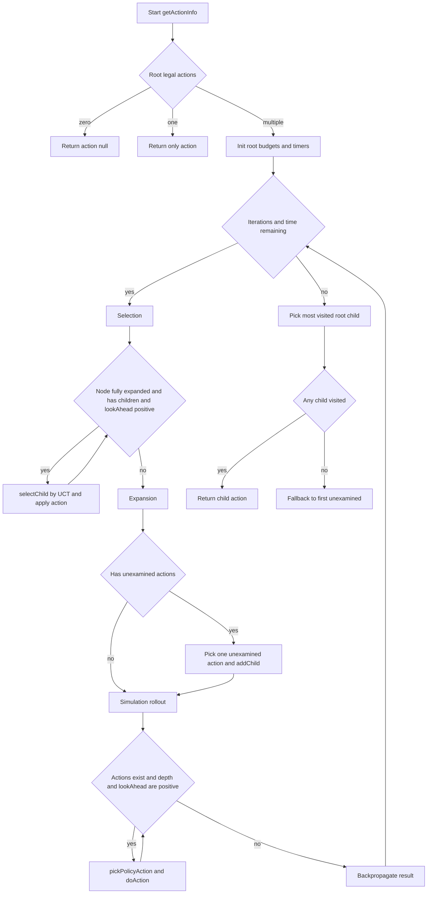
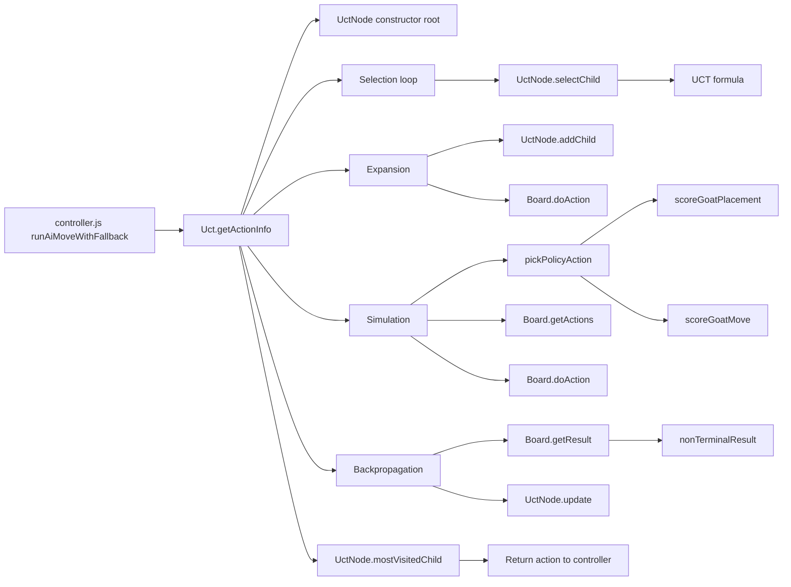
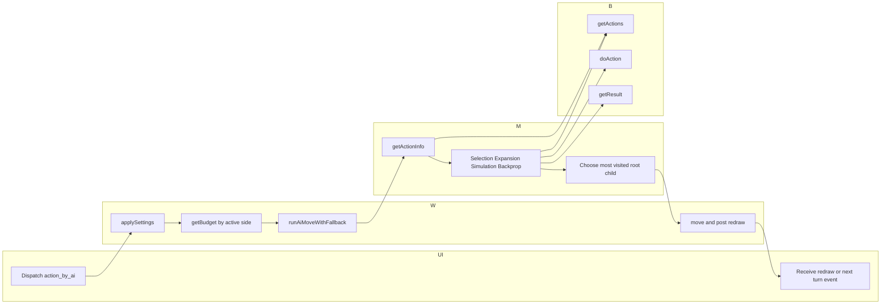
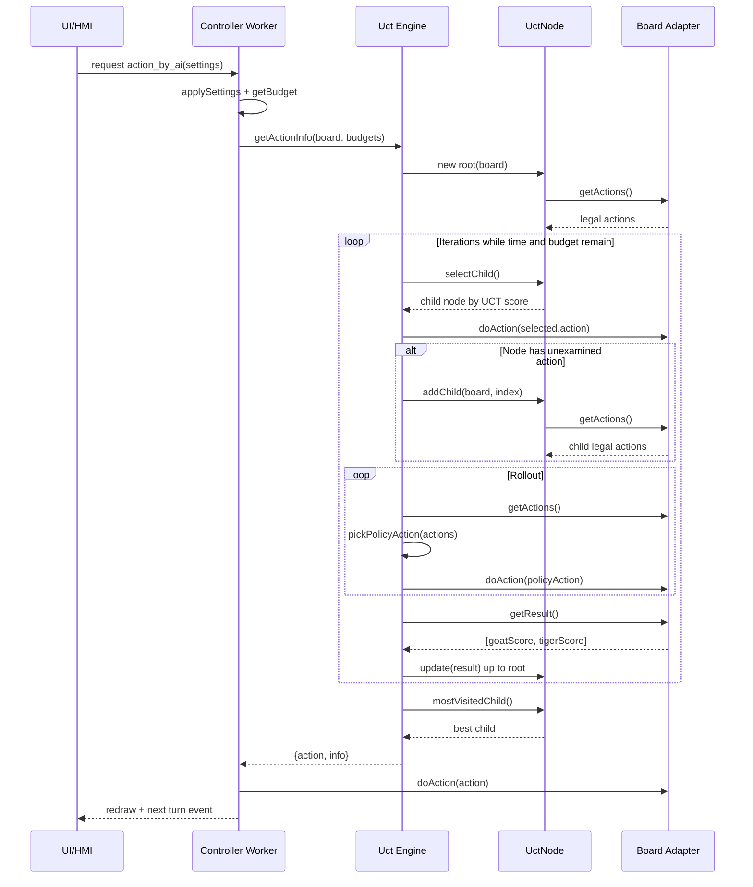
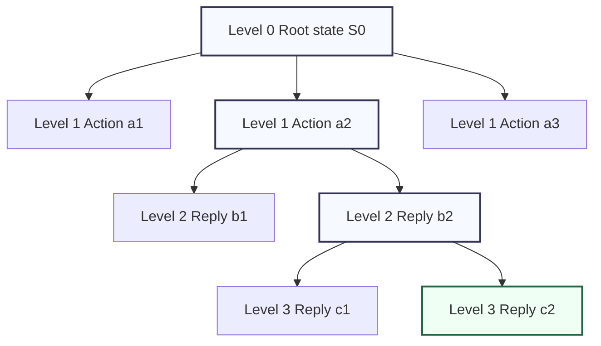
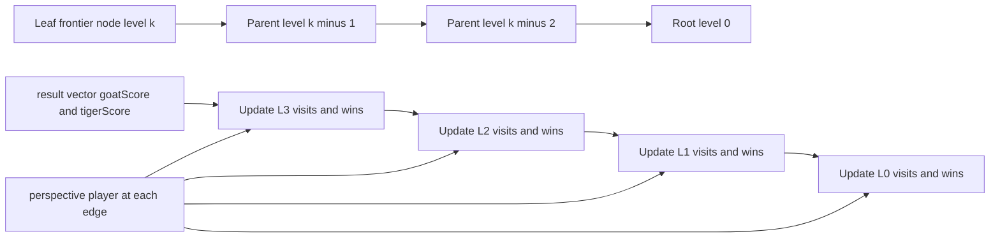
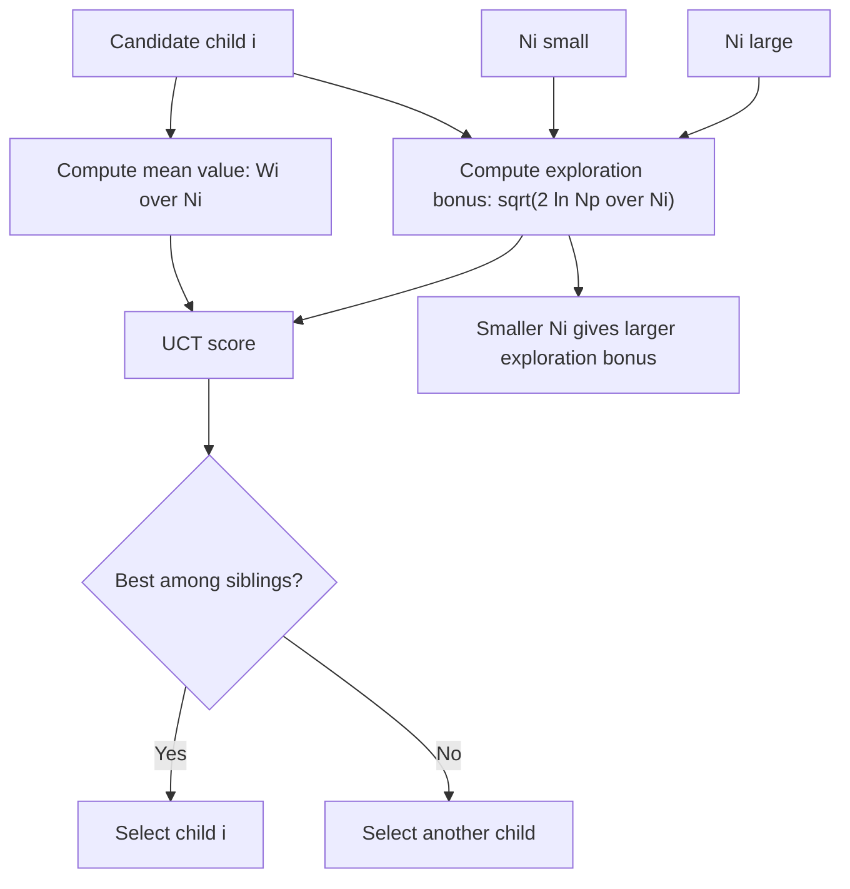
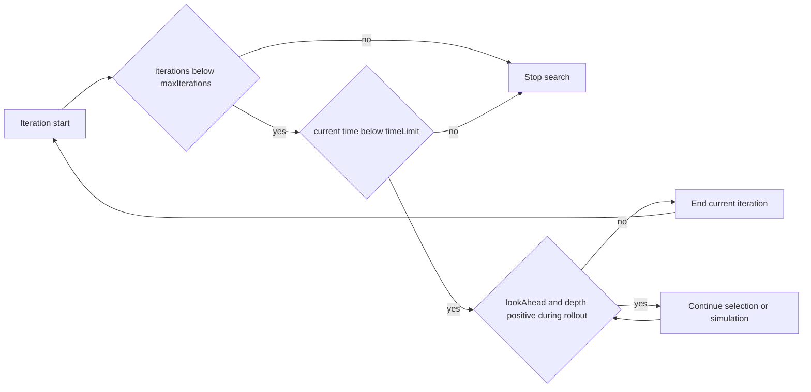

# UCT / MCTS Engine (Bagh Chal)

This document explains the AI search engine currently implemented in:

- js/uct/uct.js
- js/uct/uctnode.js
- js/board.js (terminal and non-terminal evaluation)
- js/controller.js (worker integration and difficulty wiring)

It is intentionally theory-focused for developers who need to maintain or improve engine strength.

For broader system structure and module interactions, see [software_architecture.md](software_architecture.md).

## 1. Engine Entry Point and Contract

Search entry point:

```js
Uct.getActionInfo(board, maxIterations, maxTime, maxDepthSimulation, maxLookAhead)
```

Return shape:

```js
{ action: number | null, info: string }
```

Behavior:

- No legal moves: `action: null`
- Exactly one legal move: returned immediately
- Otherwise: run UCT/MCTS loop and return the root child with highest visit count
- If budget is exhausted before any expansion: fallback to first unexamined root action

Why most-visited root child?

- Visit count is typically more stable than mean value near the end of search.
- It reflects where most search effort converged under UCT.

## 2. The Four Main MCTS Phases

Each MCTS iteration in `Uct.getActionInfo(...)` performs these four phases:

### 2.1 Selection

Start at root and repeatedly choose best child by UCT score until:

- a node with unexpanded actions is reached, or
- no children remain, or
- lookahead budget is exhausted

In code, this is the `while (node.unexamined.length === 0 && node.children.length > 0 && lookAhead > 0)` loop.

### 2.2 Expansion

If the selected node still has unexamined legal actions:

- choose one unexamined action (uniform random among unexpanded edges)
- apply it on the copied board state
- add a new child node for this action

In code, this is `node.addChild(variantBoard, j)` after applying `variantBoard.doAction(...)`.

### 2.3 Simulation (Rollout)

From the expanded node, simulate forward to estimate outcome, bounded by:

- `maxDepthSimulation`
- `maxLookAhead` remaining depth
- no legal actions

This project uses policy-guided rollouts (not pure random):

- Tigers prioritize captures
- Goats score candidate actions to avoid immediate tactical loss
- Epsilon-greedy randomness is retained for diversity

### 2.4 Backpropagation

After simulation, compute result vector `result = [goatScore, tigerScore]` and propagate upward:

- increment visits on each node in path
- add perspective-correct score to each node's `wins`

Perspective handling is critical: node value is stored from the perspective of the player choosing that node from its parent.

## 3. Exploration vs. Exploitation (UCT Math)

The core child selection rule in `UctNode.selectChild()` is:

$$
UCT_i = \frac{W_i}{N_i} + \sqrt{\frac{2 \ln N_p}{N_i}}
$$

Where:

- $W_i$: accumulated reward (`child.wins`)
- $N_i$: child visits (`child.visits`)
- $N_p$: parent visits (`this.visits`)

Interpretation:

- Exploitation term: $W_i / N_i$
  - favors moves already performing well
- Exploration term: $\sqrt{(2 \ln N_p)/N_i}$
  - favors less-visited moves
  - shrinks as $N_i$ grows

Balance intuition:

- Early search: exploration term large, broad sampling
- Late search: exploitation term dominates, stable best-line focus

Implementation note:

- This code uses fixed exploration constant implied by UCB1 form (`2` inside square root).
- If future tuning is needed, expose a configurable exploration constant $c$:

$$
UCT_i = \frac{W_i}{N_i} + c\sqrt{\frac{\ln N_p}{N_i}}
$$

## 4. Result Semantics and Value Flow

`Board.getResult()` returns:

- Goat win: `[1, 0]`
- Tiger win: `[0, 1]`
- Draw: `[0.5, 0.5]`
- Non-terminal: heuristic estimate from `nonTerminalResult(...)`

Values are clamped to `[0.001, 0.999]` for non-terminal states to keep gradients informative and avoid degenerate zero/one behavior during backprop.

### Perspective-correct backpropagation

During `UctNode.update(result)`:

- root uses its own active player perspective
- non-root uses parent active player perspective

This keeps UCT comparisons aligned with the side that actually makes the decision at each tree depth.

## 5. Latest Optimizations That Improved Strength

The current engine includes several strength-focused updates beyond baseline random-rollout MCTS.

### 5.1 Policy-Guided Rollouts

File: `js/uct/uct.js`

- `ROLLOUT_EPSILON = 0.10`
  - 90% policy-driven choice
  - 10% random exploration for diversity
- Tiger rollout policy:
  - if capture actions exist, choose among captures
- Goat rollout policy:
  - placement score balances distance from tigers and central pressure
  - move score penalizes immediate tiger capture replies and tiger reply mobility

Current goat move tactical penalty:

$$
score = -8 \cdot immediateCaptures - 0.25 \cdot tigerReplies
$$

Effect:

- Fewer blunders that allow instant tiger captures
- Better tactical safety in simulation phase

### 5.2 Stronger Non-Terminal Evaluation

File: `js/board.js` (`nonTerminalResult`)

Current raw goat-favoring score:

$$
raw = -2.5\,goatsCaptured - 2.2\,tigerCaptures - 0.08\,tigerMobility + 0.14\,goatMobility + 0.10\,goatsOnBoard + 0.08\,goatsToPlace
$$

Then transformed via logistic function:

$$
goatScore = clamp\left(\frac{1}{1+e^{-raw}}\right),\quad tigerScore = clamp(1-goatScore)
$$

Effect:

- Stronger punishment for goat losses and tiger tactical threats
- Higher weight on goat mobility and piece development
- More informative values before terminal states are reached

### 5.3 Search Loop Robustness and Throughput

File: `js/uct/uct.js`

- Blocked iteration loop (`blockSize = 50`) reduces overhead around time checks
- Extra defensive timeout check avoids wasting iterations when clocks are exhausted
- Diagnostics now report nodes/sec and timeout-block information

Effect:

- More reliable budget adherence
- Better predictable performance on varied hardware

## 6. Difficulty and Device Budget Wiring

Difficulty and device profile are selected in UI and applied in worker logic (`js/controller.js`).

Per-turn side mapping:

- active player 0 (Goats) uses `difficultySouth`
- active player 1 (Tigers) uses `difficultyNorth`

Budget tuple order:

```text
[maxIterations, maxTime, maxDepthSimulation, maxLookAhead]
```

Profiles:

- Auto: runtime-detected and resolved to Desktop or Mobile
- Desktop: higher budgets
- Mobile: reduced budgets for responsiveness and battery

## 7. Practical Theory for Engine Developers

### 7.1 Why these components matter together

- UCT selection solves exploration/exploitation at tree level
- Rollout policy reduces noise in leaf evaluation
- Non-terminal heuristic makes truncated simulations meaningful
- Side-specific budget selection allows fair strength by role and device

Weakness in any one layer reduces total playing strength.

### 7.2 Tuning order (recommended)

1. Keep rules correctness and terminal scoring fixed first.
2. Tune non-terminal evaluation weights with reproducible scenarios.
3. Tune rollout policy penalties/bonuses.
4. Tune epsilon for diversity vs determinism.
5. Tune search budgets last, because they can hide poor heuristics.

### 7.3 Common pitfalls

- Over-random rollouts: high variance, unstable decisions
- Over-deterministic rollouts: brittle and less exploratory
- Non-terminal scores too flat: search cannot distinguish promising lines
- Incorrect perspective in backprop: seemingly strong but strategically wrong moves
- Over-budgeting mobile: latency spikes and poor UX

### 7.4 Validation strategy

- Unit tests for legality, win/loss conditions, and result semantics
- Regression tests for worker message flow and AI turn behavior
- Controlled self-play batches by side and difficulty
- Measure both win rate and tactical error patterns (for example immediate capture blunders)

## 8. Current Strength Summary

Compared with older pure-random-rollout behavior, current engine strength improved through:

- Lower rollout randomness (`epsilon = 0.10`)
- Tactical goat safety penalties in rollout move scoring
- Heavier non-terminal penalties for goat losses and tiger threats
- Better mobility/development weighting for goats

These changes produce more stable and strategically safer goat play while preserving the core UCT architecture.

## 9. Diagram Suite for Developers

This section provides complementary Mermaid diagrams for architecture reviews, onboarding, and debugging sessions.

### 9.1 End-to-End MCTS Flow



### 9.2 Function Call Graph



### 9.3 Swim Lane: One AI Turn



### 9.4 Message Exchange Among Objects



### 9.5 Simulation Tree: Node Levels and One Iteration



Interpretation of the diagram above for a single iteration:

1. Selection traverses existing tree levels, for example R -> A2 -> B2.
2. Expansion adds one new node at frontier level, for example C2.
3. Simulation continues from C2 through temporary states not stored as tree nodes.
4. Backpropagation updates visits and wins on C2, B2, A2, and R.

### 9.6 Per-Level Backpropagation Mechanics



Per-level rule:

- Visits always increment by 1 for every node on the path.
- Wins are incremented using the result component of the player who chooses that node from its parent.

### 9.7 Exploration vs Exploitation Decision Surface



Decision intuition at node level:

- If a child is under-visited, exploration bonus is high and can outweigh lower mean value.
- If a child is heavily visited, exploration bonus decays and mean value dominates.

### 9.8 Budget Gates in the Search Loop



This shows why search strength is a product of both quality and budget:

- Better policy and heuristic increase value per simulation.
- Higher budgets increase number of useful simulations.
